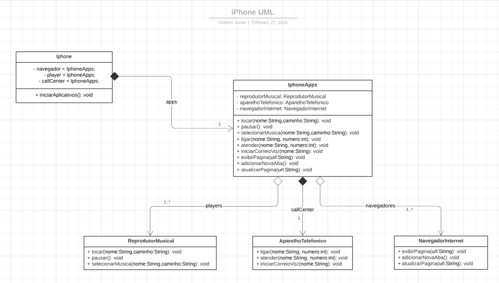

# DIO - Trilha Java Básico
www.dio.me

#### Autores
- [Gleyson Sampaio](https://github.com/glysns)

## POO - Desafio

Modelagem e diagramação da representação em UML e Código no que se refere ao componente iPhone.

Com base no vídeo de lançamento do iPhone conforme link abaixo, elabore em uma ferramenta de UML de sua preferência a diagramação das classes e interfaces com a proposta de representar os papéis do iPhone de: Reprodutor Musicial,  Aparelho Telefônico e Navegador na Internet. Em seguida crie as classes e interfaces no formato de arquivos .java

[Lançamento iPhone 2007](https://www.youtube.com/watch?v=9ou608QQRq8)

- Minutos relevantes do 00:15 até 00:55

###### Comportamentos esperados:
* Repodutor Musicial: tocar, pausar, selecionarMusica
* Aparelho Telefônico: ligar, atender, iniciarCorrerioVoz
* Navegador na Internet: exibirPagina, adicionarNovaAba, atualizarPagina

# Orientação a Objetos e UML: Diagramação de Classes do iPhone

Este diagrama UML ilustra a organização de classes e interfaces para um sistema que abrange a modelagem do iPhone, de acordo com as diretrizes estabelecidas pelo desafio na DIO.

* Para executar basta 'rodar' run a classe: [Iphone.java](src%2FIphone.java).